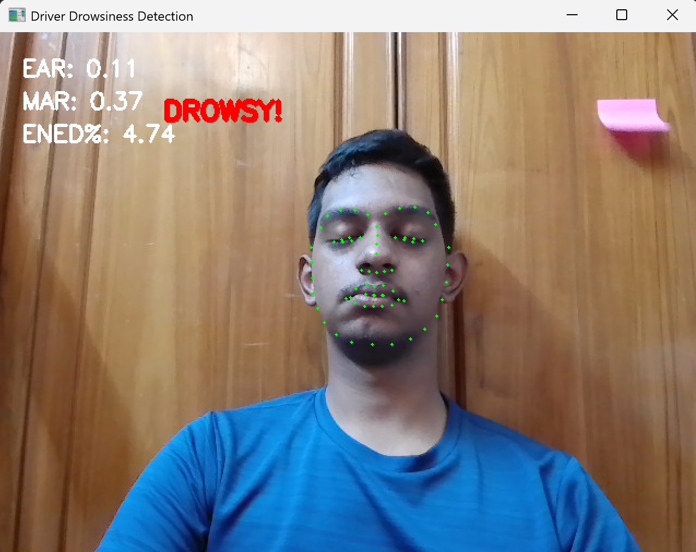
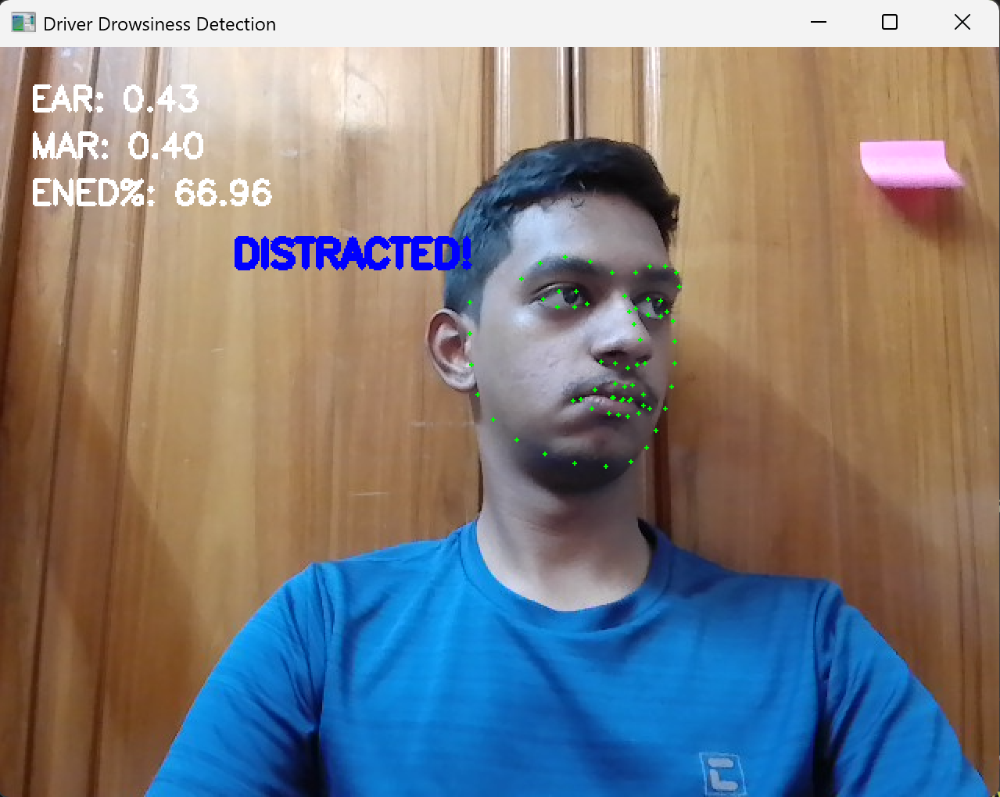
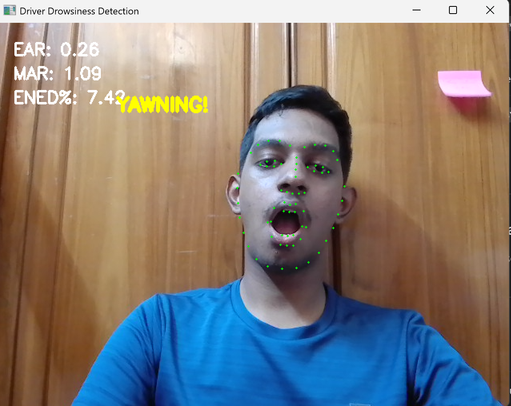
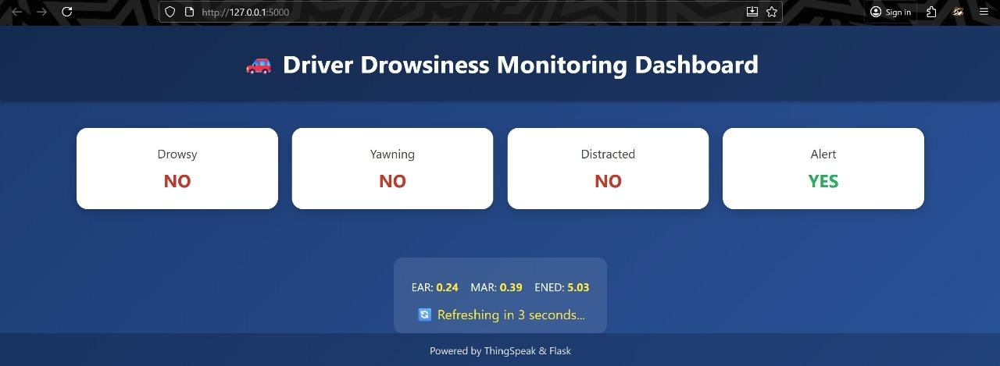

# IoT-Based Driver Drowsiness Detection System

An IoT-based non-intrusive driver monitoring system that detects:

* Drowsiness (Eyes Closed)
* Yawning
* Distraction (Head Turn)

using **Computer Vision (OpenCV + Dlib)** and provides:

* Real-time cloud data upload via ThingSpeak
* Live web monitoring dashboard using Flask

---

# Project Overview

This system continuously monitors a driver using a webcam and calculates:

* **EAR (Eye Aspect Ratio)** → Detects eye closure
* **MAR (Mouth Aspect Ratio)** → Detects yawning
* **ENED (Ear-to-Nose Euclidean Distance)** → Detects head turn/distraction

Data is uploaded to **ThingSpeak Cloud** every 15 seconds and displayed on a **Flask-based web dashboard**.

---

# System Architecture

### 1. Vision Module

* OpenCV for webcam capture
* Dlib for 68 facial landmark detection
* EAR, MAR, ENED calculation

### 2. Cloud Layer

* ThingSpeak API integration
* Periodic data upload (15s interval)

### 3. Web Interface

* Flask Web Application
* Live Driver Drowsiness Monitoring Dashboard

---

# Folder Structure

```
Drowsiness-Detection/
│
├── basepaper/
│   └── IoT-Based_Non-Intrusive_Automated_Driver_Drowsiness_Monitoring.pdf
│
├── code/
│   ├── drowsiness_detection.py
│   └── flask_app.py
│
├── dat/
│   └── shape_predictor_68_face_landmarks.dat
│
├── whl/
│   └── dlib-19.24.2-cp39-cp39-win_amd64.whl
│
├── results/
│   ├── drowsy.png
│   ├── distracted.png
│   ├── yawning.png
│   ├── dashboard.jpg
│   │
│   └── thingspeak/
│       ├── drowsy.jpeg
│       ├── distracted.jpeg
│       └── yawning.jpeg
│
└── README.md
```

---

# Technologies Used

* Python
* OpenCV
* Dlib
* Flask
* ThingSpeak Cloud
* NumPy
* Requests

---

# Installation

## 1. Install Dependencies

```bash
pip install -r requirements.txt
```

If installing manually:

```bash
pip install opencv-python
pip install numpy
pip install scipy
pip install imutils
pip install flask
pip install requests
pip install dlib
```

---

## 2. Download Dlib Model

Download:

```
shape_predictor_68_face_landmarks.dat
```

Place it inside:

```
/dat/
```

---

## 3. Run Detection Script

```bash
python drowsiness_detection.py
```

Press `q` to exit.

---

## 4️ Run Flask Dashboard

```bash
python flask_app.py
```

Open in browser:

```
http://127.0.0.1:5000
```

---

# ThingSpeak Integration

The script uploads:

| Field  | Description |
| ------ | ----------- |
| field1 | EAR         |
| field2 | MAR         |
| field3 | ENED        |

Upload interval: **15 seconds**

API Endpoint:

```
https://api.thingspeak.com/update
```

---

# Results

## Drowsiness Detection



---

## Distraction Detection



---

## Yawning Detection



---

## Flask Dashboard (ThingSpeak Live Monitoring)



---

# Detection Logic

### Eye Aspect Ratio (EAR)

If EAR < 0.20 for 2 seconds → **DROWSY**

### Mouth Aspect Ratio (MAR)

If MAR ≥ 0.60 for 3 seconds → **YAWNING**

### ENED

If ENED ≥ 8% for 3 seconds → **DISTRACTED**

---

# Base Paper

M. Adil Khan et al.,
"IoT-Based Non-Intrusive Automated Driver Drowsiness Monitoring Framework for Logistics and Public Transport Applications to Enhance Road Safety", IEEE Access, 2023.

Included in `/basepaper/`

---

# Authors

* Nithyabalan M (126003186)
* Sanjay M (126003230)
* Sherwin L (126003244)

SASTRA Deemed University
